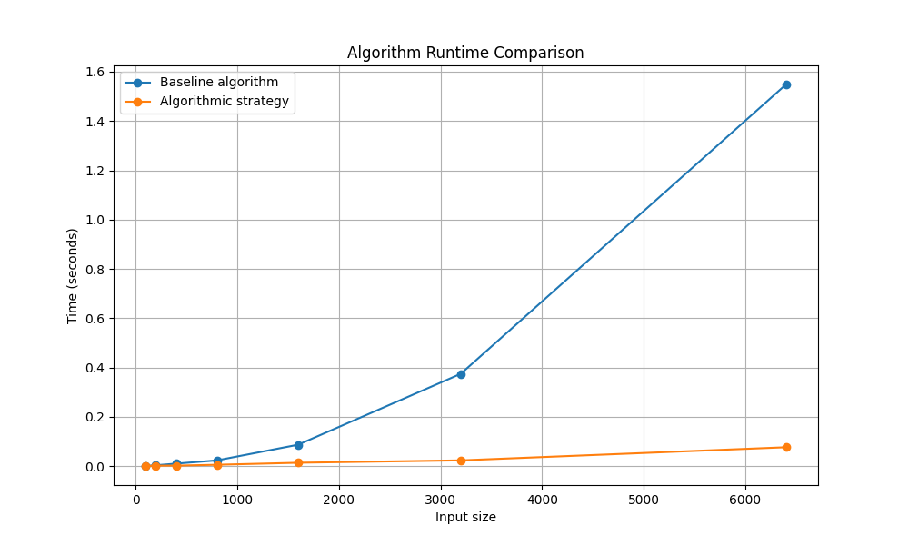
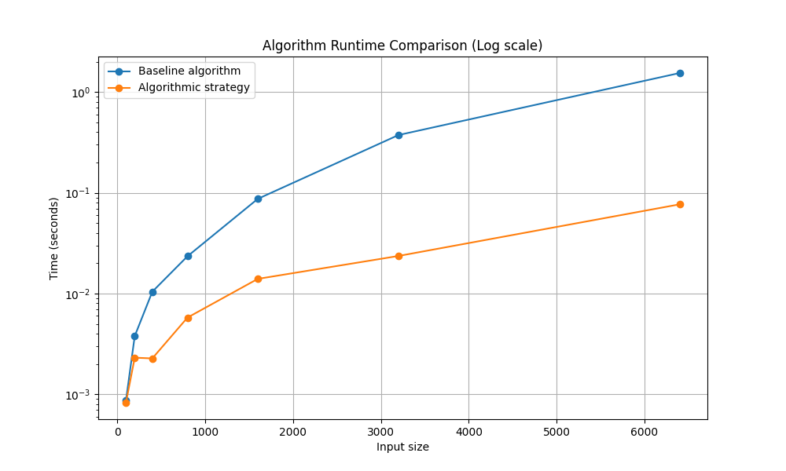

## Empirical Synthesis: 
We created visualizations using our benchmarking data. This data shows that our algorithmic soulution scales at a faster rate proving that our algoritm grows faster then $O(n^2)$ that our basline runs at. 

|  |  |
|---|---|

## Baseline Comparison: 
From our algorthimic analyisis we can onbserve how our soulution scales at a slower rate then our basline proving visualy that our runtime has improved from out basline. This comparison dirrectly shows that through mathmatical selection you can imporve a algorithims runtime from testing every soulution. 

## Reflection: 
Write a reflection on your team’s design and debugging process. Discuss any two-stage submission improvements made from earlier weeks. Be specific about your challenges: detail specific structural pivots your team had to make, or debugging moments that led to critical breakthroughs